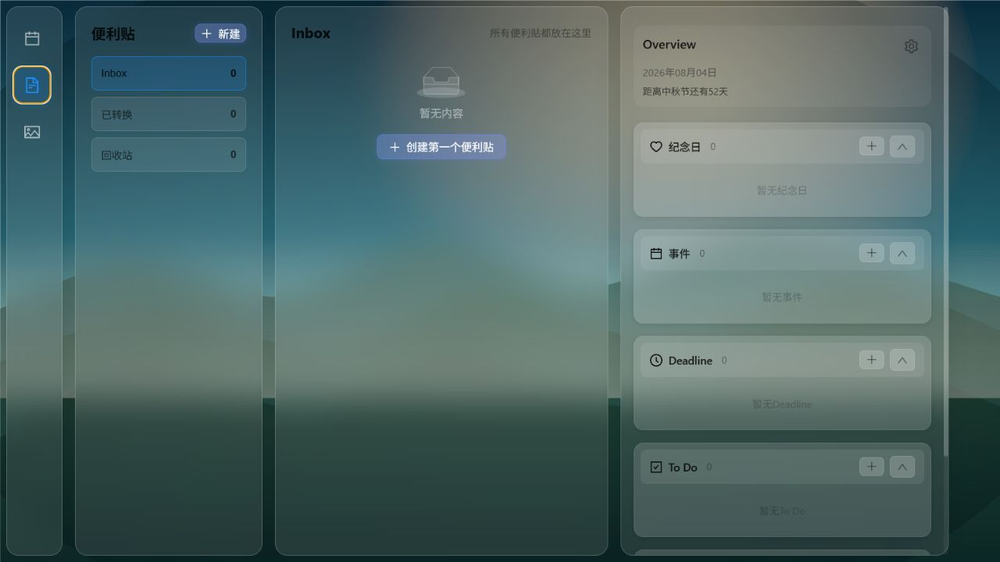
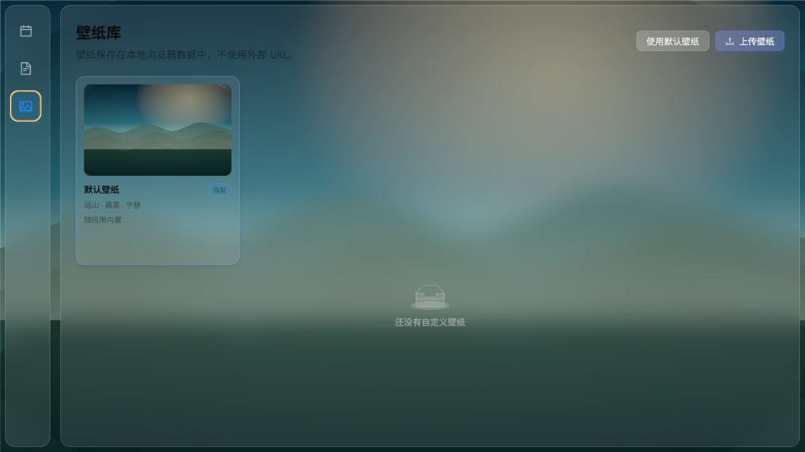

# LifeTally

LifeTally 是一个本地优先的个人生活管理网页，围绕日历、便利贴和本地壁纸库组织日常信息。纪念日、事件、Deadline、To Do、Daily To Do 与便利贴共享统一对象模型，并支持软删除、恢复和便利贴类型转换。

> LifeTally is a local-first personal calendar, sticky-note inbox, and wallpaper library built with React, TypeScript, Vite, and IndexedDB.

## 界面

| 日历 | 便利贴 | 壁纸库 |
| --- | --- | --- |
|  |  |  |

截图使用空白或虚构数据，不包含个人备份或第三方壁纸。

## 当前功能

- **日历**：按月查看日期，并管理纪念日、事件、Deadline、To Do 和 Daily To Do。
- **便利贴**：统一 Inbox、最近五次转换记录和回收站；便利贴可转换为任意计划对象，计划对象也可转回便利贴。
- **壁纸库**：默认壁纸随应用内置，用户壁纸以 Blob 保存在本地 IndexedDB，可上传、切换、重命名和删除。
- **数据安全**：对象采用软删除，回收站内才能永久删除；支持版本化 JSON 备份与校验后的合并导入。
- **节假日**：内置已验证年度数据，支持自动更新、本地缓存和用户覆盖。

应用默认进入日历。当前版本没有搜索页、账号系统、云同步、遥测、GitHub Pages 部署或浏览器扩展包装。

## 快速开始

要求 Node.js 22.12 或更高版本。

```powershell
git clone https://github.com/cang6ng/LifeTally.git
cd LifeTally/app
npm ci
npm run dev
```

开发服务器默认只监听 `127.0.0.1`。终端会显示实际访问地址。

## 检查与构建

在 `app` 目录运行：

```powershell
npm run typecheck
npm test
npm run build
```

正式构建生成在 `app/dist/`，该目录不提交 Git。

## 本地数据

- IndexedDB：`LifeTallyPageV0DB`，保存对象、壁纸和转换记录。
- localStorage：仅使用 `lifetally:v0:*` 命名空间保存页面设置和节假日缓存。
- 导入备份采用合并语义：相同 id 更新，不在备份中的现有数据保留。

清除站点数据或浏览器配置可能永久删除内容。执行此类操作前请先导出备份。详细说明见 [数据与备份](./docs/data-and-backup.md) 和 [隐私说明](./PRIVACY.md)。

## 项目结构

```text
app/src/
├─ core/          稳定的跨页面基础能力
├─ db/            IndexedDB schema 与迁移
├─ stores/        页面状态和对象状态
├─ services/      壁纸、回收站、转换记录等服务
├─ providers/     节假日外部数据适配
├─ views/         日历、便利贴、壁纸与编辑器
└─ utils/         日期、对象转换和备份边界
```

删除或增加可选页面不得改变核心对象事实来源、数据库名称或稳定备份格式。架构约束见 [架构说明](./docs/architecture.md)。

## 文档

- [产品基线](./docs/product.md)
- [架构说明](./docs/architecture.md)
- [数据与备份](./docs/data-and-backup.md)
- [节假日数据](./docs/holiday-data.md)
- [开发与发布](./docs/development.md)
- [路线图](./docs/roadmap.md)
- [贡献指南](./CONTRIBUTING.md)
- [安全政策](./SECURITY.md)
- [第三方与资产声明](./THIRD_PARTY_NOTICES.md)

## 当前限制

- 数据只属于当前浏览器 origin，不会跨浏览器或设备同步。
- 浏览器存储配额不足时，大型壁纸可能保存失败。
- 首发构建主包仍有体积提醒，后续会按页面拆分。
- 当前自动测试聚焦核心规则，尚未引入真实浏览器 E2E 测试。

## 参与贡献

欢迎提交 Issue 和 Pull Request。涉及数据格式、迁移、外部请求或新依赖时，请先说明兼容性与隐私影响，并遵循 [CONTRIBUTING.md](./CONTRIBUTING.md)。

## 许可证

代码和项目原创资产按 [MIT License](./LICENSE) 提供；第三方内容适用其各自许可。
